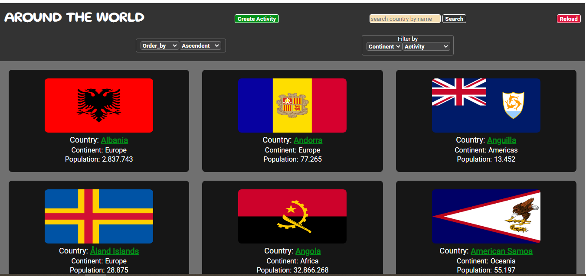
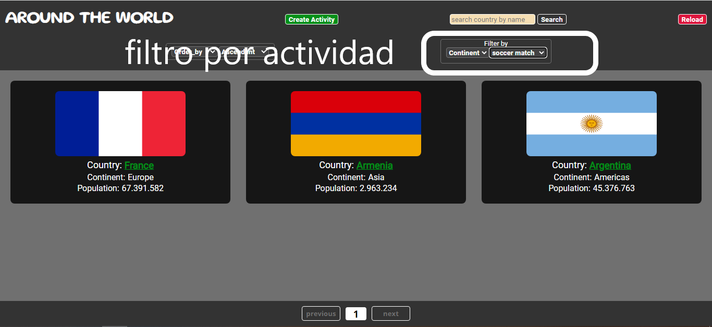
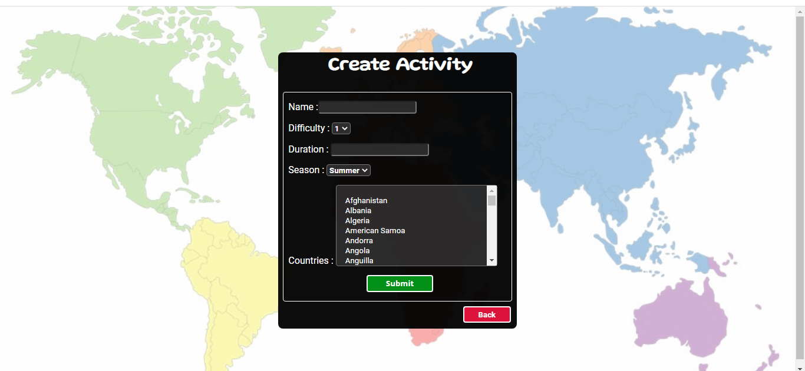

# Individual Project - Around the World!

  
  

  
  

## Español

## Descripción del Proyecto

Esta aplicacion realiza consultas a una base de datos propia y tiene informacion sobre 250 paises aproimadamente,  bandera, región, cantidad de población entre otros.
Esta información fue obtenida mediante una consulta a la API externa https://restcountries.com

También tiene la posibilidad de agregarle actgividades turísticas a los mismos con los siguientes datos: nombre de la actividad, duración, dificultad y temporada.
Se pueden realizar búsquedas y filtros tanto por nombre de país como por actividades turísticas, cantidad de población y continente 

#### Tecnologías utilizadas:

#### Back End
- [ ] Node JS
- [ ] Express JS
- [ ] Sequelize
- [ ] Base de datos PostgreSQL
- [ ] PGAdmin
- [ ] Thunder Client

#### Frontend
- [ ] HTML
- [ ] CSS3
- [ ] JavaScript
- [ ] React
- [ ] Redux

## English

## Project description

This application makes queries to its own database and has information on approximately 250 countries, flag, region, number of population among others. 
This information was obtained through a query to the external API https://restcountries.com

You also have the possibility of adding tourist activities to them with the following information: name of the activity, duration, difficulty and season.
Searches and filters can be carried out both by country name and by tourist activities, number of population and continent

#### Tecnologíes:

#### Back End
- [ ] Node JS
- [ ] Express JS
- [ ] Sequelize
- [ ] Base de datos PostgreSQL
- [ ] PGAdmin
- [ ] Thunder Client

#### Frontend
- [ ] HTML
- [ ] CSS3
- [ ] JavaScript
- [ ] React
- [ ] Redux

#### Author: Edgardo Javier González

